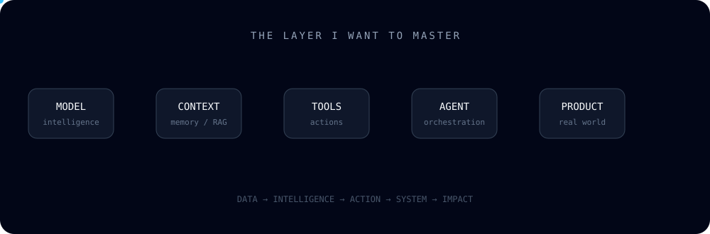

<div align="center">



<br/>

<a href="https://github.com/pratik-aher-01">

</a>
<a href="https://github.com/pratik-aher-01">

</a>
<a href="https://github.com/pratik-aher-01?tab=followers">

</a>

</div>

---

## `$ whoami`

**Pratik Aher** — AI & Data Science Engineer, independent learner, and builder.

I’m focused on understanding how intelligent software is actually engineered:

`models` → `context` → `tools` → `orchestration` → `infrastructure` → `product`

I don't want to just use AI.

**I want to understand, build, ship, and eventually create products around it.**

---

## `$ motion_engine`

<div align="center">


<br/>

`●` MODEL <b>ONLINE</b> &nbsp;&nbsp; `●` CONTEXT <b>READY</b> &nbsp;&nbsp; `●` BUILD <b>ACTIVE</b>

</div>

---

## `$ current_state`

<div align="center">

| | Focus |
|:---:|---|
| 🧠 | **AI / ML** — ML, DL, NLP, CV, LLMs |
| ⚙️ | **AI Systems** — Agents, RAG, tool use, orchestration |
| 🏗️ | **Engineering** — APIs, backend, databases, architecture |
| 🚀 | **Product** — Turning technical ideas into useful software |

</div>

<br/>

<div align="center">

`LEARNING`  →  `EXPERIMENTING`  →  `BUILDING`  →  `SHIPPING`  →  `ITERATING`

</div>

---

## `$ system_motion`

<div align="center">



</div>

> **Models → context → tools → agents → infrastructure → products**

This is the layer of the stack I want to master.

---

## `$ now`

<div align="center">


</div>

### Current obsessions

```yaml
ai:
  - agents
  - llm systems
  - rag
  - mcp
  - multimodal systems

engineering:
  - backend architecture
  - system design
  - apis
  - databases
  - deployment

mindset:
  - fundamentals
  - deliberate practice
  - build > consume
  - long-term compounding
```

---

## `$ tech_stack`

<div align="center">

| Layer | Technologies |
|:--|:--|
| **Languages** |  |
| **AI / ML** |  |
| **Frontend** |  |
| **Backend** |  |
| **Databases** |  |
| **Tools / DevOps** |  |

<sub>Exploring: LLMs · RAG · AI Agents · MCP · NLP · Computer Vision</sub>

</div>

---

## `$ philosophy`

<div align="center">

### BUILD → BREAK → UNDERSTAND → REBUILD → SHIP

</div>

I believe the fastest way to understand complex systems is to **build them**.

Not just tutorials.

Not just API calls.

Not just copying architectures.

Build something. Hit the wall. Read the internals. Fix it. Make it production-worthy.

That loop compounds.

---

## `$ live_telemetry`

<div align="center">


</div>

<br/>

<div align="center">


<br/><br/>


</div>

---

## `$ activity`

<div align="center">


</div>

---

## `$ contribution_engine`

<div align="center">

<picture>
  <source media="(prefers-color-scheme: dark)" srcset="https://raw.githubusercontent.com/pratik-aher-01/pratik-aher-01/output/github-snake-dark.svg" />
  <source media="(prefers-color-scheme: light)" srcset="https://raw.githubusercontent.com/pratik-aher-01/pratik-aher-01/output/github-snake.svg" />
  
</picture>

</div>

---

## `$ operating_principles`

```text
01  Fundamentals > abstractions.

02  Build > consume.

03  Understanding > memorization.

04  Systems > isolated features.

05  Shipping > perfection.

06  Compounding > shortcuts.
```

---

## `$ roadmap`

<div align="center">

`FOUNDATIONS` → `SYSTEMS` → `INTELLIGENCE` → `PRODUCTS` → `SCALE`

</div>

The profile will evolve as the work gets stronger.

**No filler projects. No inflated claims. No badge collecting.**

When there is something genuinely worth showing, it earns a place here.

---

## `$ future`

I’m not trying to become someone who simply **knows AI tools**.

The goal is to become someone who can take:

```text
                    an idea
                       ↓
                 understand it
                       ↓
                  design it
                       ↓
                   build it
                       ↓
                  deploy it
                       ↓
                   improve it
                       ↓
                  turn it into
                    a product
```

That's the game.

---

<div align="center">

### `STILL BUILDING. STILL LEARNING. STILL SHIPPING.`

<br/>

<a href="https://github.com/pratik-aher-01">

</a>

<br/><br/>


</div>
