 

---

## About

I'm **Pratik Aher**, an AI & Data Science engineer interested in the space between **intelligence, software, and products**.

I learn by building things, taking them apart, understanding why they work, and rebuilding them better.

My long-term direction:

**AI → Systems → Products**

---

## What I'm exploring

- **AI / ML** — machine learning, deep learning, NLP, computer vision
- **AI systems** — LLMs, RAG, agents, tool use, MCP
- **Software engineering** — backend, APIs, databases, system design
- **Product engineering** — turning technical ideas into useful software

---

## Stack

**Languages**

  

**AI / Data**

  

**Web / Backend**

  

**Data / Infrastructure**

---

## How I work

**BUILD → BREAK → UNDERSTAND → REBUILD → SHIP**

I care more about understanding a system than collecting technologies.

Less tutorial-hopping.  
More experiments.  
More real systems.  
More shipping.

---

## GitHub

  

---

## Contributions

<picture>
  <source media="(prefers-color-scheme: dark)" srcset="https://raw.githubusercontent.com/pratik-aher-01/pratik-aher-01/output/github-snake-dark.svg" />
  <source media="(prefers-color-scheme: light)" srcset="https://raw.githubusercontent.com/pratik-aher-01/pratik-aher-01/output/github-snake.svg" />
  
</picture>

---

## Principles

`FUNDAMENTALS` · `CURIOSITY` · `EXPERIMENTS` · `SYSTEMS` · `SHIPPING`

No inflated claims.  
No filler projects.  
When something is genuinely worth showing, it belongs here.

---

  

